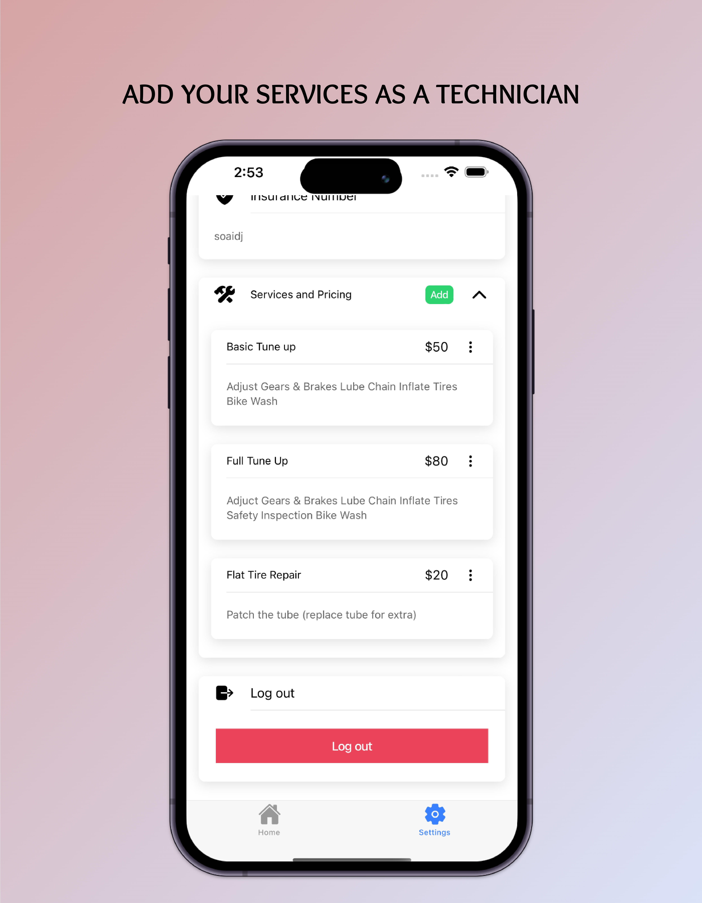
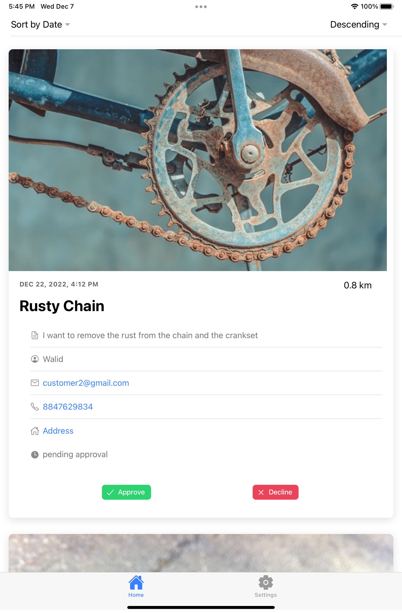
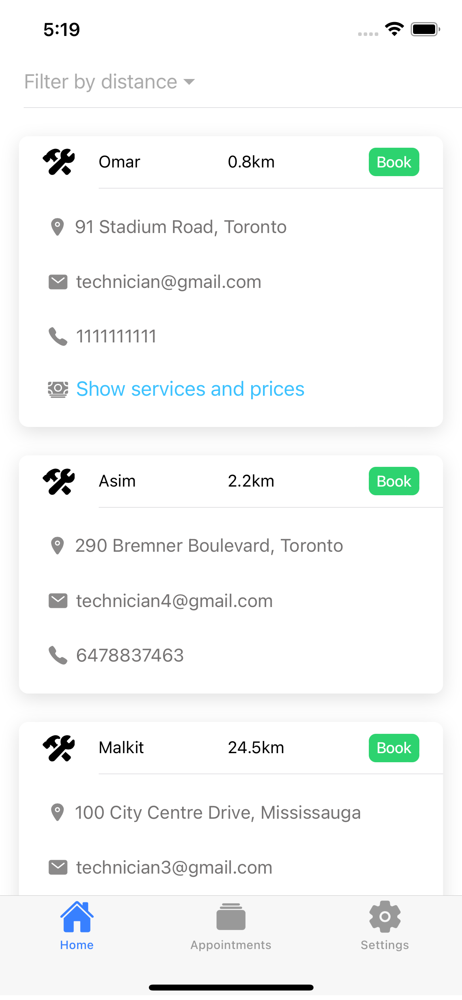
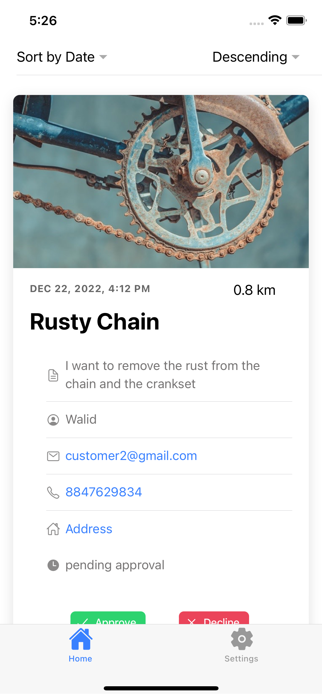

  

<h3 align="center">Mobichanic</h3>

   An iOS and Android app that allows you to book a bicycle technician directly to your doorstep and provide repair services for your bike. The app also allows you to sign up as bike technician and make some extra money
  

### Built With

* ![Angular]
* ![Html]
* ![CSS]
* ![JavaScript]
* ![Ionic]
* ![Capacitor]
* ![Jasmine]

## Screenshots

   
  
  
  

### Demo Video

[Angular]: https://img.shields.io/badge/Angular-DD0031?style=for-the-badge&logo=angular&logoColor=white
[Html]: https://img.shields.io/badge/html5-E34F26?style=for-the-badge&logo=html5&logoColor=white
[CSS]: https://img.shields.io/badge/css3-1572B6?style=for-the-badge&logo=css3&logoColor=white
[JavaScript]: https://img.shields.io/badge/javascript-F7DF1E?style=for-the-badge&logo=javascript&logoColor=grey
[Ionic]: https://img.shields.io/badge/ionic-3880FF?style=for-the-badge&logo=ionic&logoColor=white
[Capacitor]: https://img.shields.io/badge/capacitor-119EFF?style=for-the-badge&logo=capacitor&logoColor=white
[Jasmine]: https://img.shields.io/badge/jasmine-8A4182?style=for-the-badge&logo=jasmine&logoColor=white

